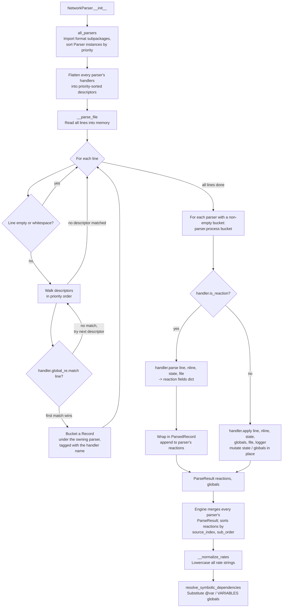

---
tags:
    - Development
icon: phosphor/file-code
---

# Adding a New Network Parser

JAFF's file parser (`NetworkParser` in `src/jaff/core/parsers/network/_engine.py`) auto-detects the format of an astrochemical network file and parses each reaction line into a common internal representation. Each supported format is a self-contained **parser**: one `Parser` subclass that lives in its own subpackage's `parser.py` under `core/parsers/network/_formats/` and owns a list of plain **handler** objects (one per line-type). Adding a new format means adding one subpackage — the engine and the existing formats are never touched.

## How the Parser Works

The engine (`_engine.py`) discovers every registered parser through `all_parsers()` (in `_formats/_parser.py`) and sorts them by priority. Detection, however, is driven by each parser's **handlers**, not the parser itself: the engine flattens every handler across every parser into one list of `(priority, global_re, is_reaction, name, parser)` descriptors, sorted by the handler's own `priority` (lower is matched first — **not** file or import order).



### The `Parser` contract

Every format subclasses `Parser` (`_formats/_parser.py`, the **only** ABC in this model) and implements:

| Member                      | Purpose                                                                                                   |
| ---------------------------- | ---------------------------------------------------------------------------------------------------------- |
| `name: str`                  | Unique parser identifier (the subpackage folder name); the engine buckets records under this name.        |
| `priority: int`              | Ordering hint on the parser itself (line detection is driven by each *handler's* own `priority`).         |
| `handlers: list`             | The parser's handler objects, set in `__init__`.                                                           |
| `process(records) -> ParseResult` | Walk the parser's bucket of `Record`s (already in file order) and return the parsed reactions + globals. |

`Parser` also provides `_initial_state()`, which merges every handler's `default_state()` (if it defines one) into a single local `state` dict — call it at the top of `process` for formats that need mutable, file-order state.

There is no shared `ParseContext` threaded through handlers anymore: each parser keeps its own local `state` dict and its own `globals` dict inside `process`, and returns both (as `ParseResult.reactions` / `ParseResult.globals`) for the engine to merge.

### Handlers: one per line-type, no base class

A **handler** is a plain class — it does not subclass anything — living in its own file (e.g. `krome/header.py`, `krome/var.py`, `krome/reaction.py`). It exposes:

| Member                      | Purpose                                                                                                          |
| ----------------------------- | -------------------------------------------------------------------------------------------------------------- |
| `name: str`                  | Unique handler identifier; the `Record.format` tag used to look the handler back up in `process`.               |
| `priority: int`               | Match order across **all** handlers of **all** parsers. Use the gap-spaced scheme below so new formats slot in cleanly. |
| `is_reaction: bool`           | `True` for a reaction line-type (implements `parse`); `False` for a directive (implements `apply`).             |
| `global_re`                   | Fast, broad filter — a compiled `re.Pattern` (or a method returning one). Identifies lines that _could_ belong to this handler. Matched first, across all handlers, in priority order. |
| `local_re`                    | Detailed extractor — uses **named groups** to capture every field. Matched inside `parse`/`apply`.               |
| `default_state() -> dict`     | Optional. Initial values this handler contributes to the parser's shared `state` dict (only for state-carrying handlers). |
| `parse(line, nline, state, file) -> dict` | Reaction handlers only. Extracts the reaction fields dict (`r`, `p`, `tmin`, `tmax`, `rate`, `type`, `string`) from *line*. |
| `apply(line, nline, state, globals, file, logger) -> None` | Directive handlers only. Mutates the parser's local `state` and/or the `globals` dict in place. |

Most `global_re`/`local_re` are static compiled patterns (module-level or class attributes), since they no longer need to depend on a shared context object. A handler whose extraction pattern depends on live state (like KROME's reaction line, whose column layout depends on an earlier `@format:` header) instead defines `local_re` as a **method** that rebuilds the pattern from the current `state`.

### The Parsed Reaction Dict

A reaction handler's `parse` returns a dict with exactly these keys (the same shape `ParsedRecord` is built from):

| Key        | Type            | Description                                         |
| ---------- | --------------- | ---------------------------------------------------- |
| `"r"`      | `list[str]`     | Reactant name strings (include any agent pseudo-species, see below) |
| `"p"`      | `list[str]`     | Product name strings                                |
| `"tmin"`   | `float or None` | Lower temperature bound in Kelvin, or `None`        |
| `"tmax"`   | `float or None` | Upper temperature bound in Kelvin, or `None`        |
| `"rate"`   | `str`           | Rate expression as a Python/SymPy-compatible string |
| `"type"`   | `str`           | Reaction type concluded by the parser: `"photo"`, `"cosmic_ray"`, `"3_body"`, or `"unknown"` (or a more specific structural type, see `kida/reaction.py`) |
| `"string"` | `str`           | Original network-file line (for error reporting)    |

The parser's `process` wraps this dict in a `ParsedRecord` (from `_formats/_record.py`), adding `source_index` and `sub_order` from the `Record` the engine handed it. `ParsedRecord.as_parsed_props()` converts it back to this same dict (+ `source_index`) for `Network` to consume.

### Concluding the reaction type

The parser — not the rate expression — decides the reaction `"type"`. Conclude
it **structurally** so it survives custom/auxiliary rates, and inject the driving
**agent pseudo-species** into the reactant list when the format implies one but
the line omits it:

- A radiation-driven reaction carries `_PHOTON` as a reactant → `"photo"`.
- A cosmic-ray reaction carries `_CR` / `_CRP` / `_CRPHOT` → `"cosmic_ray"`.
- Three or more *real* (non-`_`) reactants → `"3_body"`.
- Otherwise `"unknown"`.

These special pseudo-species (leading `_`) give a reaction its identity and
serialization but are excluded from the kinetics. See the existing formats'
`_reaction_type` and agent-injection logic (e.g. `kida/reaction.py`,
`krome/reaction.py`) for reference implementations.

After all parsers have run, the engine sorts every collected `ParsedRecord` by `(source_index, sub_order)`, `__normalize_rates` lower-cases every `"rate"` string, and `resolve_symbolic_dependencies` substitutes any global variables (e.g. from `@var` or `VARIABLES` blocks, merged from every parser's `ParseResult.globals`) into the expressions.

---

## Step-by-Step: Adding a New Format

### 1. Create the format subpackage

Add a folder under `src/jaff/core/parsers/network/_formats/`, e.g. `my_format/`, with a `reaction.py` handler module and a `parser.py` that registers the `Parser` subclass. Multi-line-type formats (like KROME's `@format:` header, `@var:`, and reaction lines) get one module per line type — see `krome/` (`header.py`, `var.py`, `reaction.py`).

The simplest shape — a single reaction handler and no shared state — mirrors `kida/`:

```python title="_formats/my_format/reaction.py"
import re

from ......errors import ParserError


class MyFormatReaction:
    """My pipe-delimited reaction line handler."""

    name = "my_format"
    priority = 55
    is_reaction = True

    global_re = re.compile(r"^(?!\s*[!#@]).*\|.*$")  # (1)

    local_re = re.compile(  # (2)
        r"^\s*"
        r"(?P<reactants>[^|]+)\s*\|\s*"
        r"(?P<products>[^|]+)\s*\|\s*"
        r"(?P<tmin>[^|]*)\s*\|\s*"
        r"(?P<tmax>[^|]*)\s*\|\s*"
        r"(?P<rate>.*?)\s*$"
    )

    def parse(self, line: str, nline: int, state: dict, file) -> dict:  # (3)
        local = self.local_re.match(line)
        if not local:
            raise ParserError("Invalid MY_FORMAT reaction detected", line, nline, file)

        rr = [r.strip() for r in local.group("reactants").split("+") if r.strip()]
        pp = [p.strip() for p in local.group("products").split("+") if p.strip()]

        tmin_str = local.group("tmin").strip()
        tmax_str = local.group("tmax").strip()
        t_min = float(tmin_str) if tmin_str else None
        t_max = float(tmax_str) if tmax_str else None

        # Replace any format-specific symbols with JAFF canonical names
        rate = local.group("rate").strip().replace("my_crflux", "crate")

        # Conclude the reaction type structurally. Three or more real
        # reactants => 3-body.
        rtype = "3_body" if sum(not r.startswith("_") for r in rr) >= 3 else "unknown"

        return {
            "r": rr,
            "p": pp,
            "tmin": t_min,
            "tmax": t_max,
            "rate": rate,
            "type": rtype,
            "string": line.strip(),
        }
```

```python title="_formats/my_format/parser.py"
from .._parser import Parser, register
from .._record import ParsedRecord, ParseResult
from .reaction import MyFormatReaction


@register
class MyFormatParser(Parser):
    """Parses the MY_FORMAT pipe-delimited reaction format."""

    name = "my_format"
    priority = 55

    def __init__(self):
        self.handlers = [MyFormatReaction()]

    def process(self, records) -> ParseResult:
        """Parse each MY_FORMAT reaction record into a :class:`ParsedRecord`."""
        state = self._initial_state()
        by_name = {h.name: h for h in self.handlers}
        reactions: list[ParsedRecord] = []

        for rec in records:
            handler = by_name[rec.format]
            fields = handler.parse(rec.line, rec.nline, state, self.file)
            reactions.append(
                ParsedRecord(
                    **fields,
                    source_index=rec.source_index,
                    sub_order=rec.sub_order,
                )
            )

        return ParseResult(reactions, {})
```

1. **`global_re`** — match any non-comment line that contains `|`. Keep it broad and fast; it is checked against **every** line before any handler's `local_re` runs.
2. **`local_re`** — use named groups (`?P<name>`) to capture every field. Named groups map directly to `#!python local.group("name")` calls in your handler.
3. **`parse`** — receives the matched line, the parser's shared `state` dict, and the source file (for error messages); extracts fields and returns the reaction dict. Raise `ParserError` directly (there is no `ctx.raise_error` helper — handlers own no shared context object).

!!! warning "Choosing `priority`"
    Handlers are matched in ascending `priority`, across **all** parsers at once. Place your handler **before** any handler whose `global_re` would also match your lines, and **after** any that should take precedence. The existing order (gap-spaced so you can insert between any two without renumbering):

    | priority | handler        |
    | -------- | -------------- |
    | 10       | `krome_format` (`@format:` header) |
    | 20       | `krome_var` (`@var:`)              |
    | 30       | `prizmo_vars` (`VARIABLES { }`)    |
    | 40       | `prizmo` (reaction)                |
    | 50       | `udfa`                             |
    | 60       | `krome` (reaction)                 |
    | 70       | `uclchem`                          |
    | 80       | `kida`                             |

    Formats with more specific `global_re` patterns (e.g. `krome_format` matches only `@format:` lines) should get a lower number than broader ones.

---

### 2. Export and register the format

Add the subpackage's `__init__.py` so the `parser` module is imported (which runs its `@register` decorator):

```python title="_formats/my_format/__init__.py"
from .parser import MyFormatParser

__all__ = ["MyFormatParser"]
```

`all_parsers()` (in `_formats/_parser.py`) discovers every registered parser automatically via `import_subpackages`, which imports every subpackage under `_formats/` — there is no central import line to edit. Adding the subpackage above is the only new file besides the format's own handler(s) and `parser.py`.

---

### 3. (Optional) Share live state across line types

If your format has a header line that configures later reaction lines (like KROME's `@format:`), give both handlers a `default_state()` that seeds the **same** keys into the parser's shared `state` dict, and have the header's `apply` mutate it in place:

```python
class MyHeader:
    name = "my_header"
    priority = 15
    is_reaction = False

    def default_state(self) -> dict:
        return {"ncols": 0}

    def apply(self, line, nline, state, globals, file, logger) -> None:
        state["ncols"] = ...  # header writes shared state


class MyFormatReaction:
    name = "my_format"
    priority = 55
    is_reaction = True

    def local_re(self, state: dict):
        ncols = state["ncols"]  # reaction reads live state, rebuilding the pattern
        ...

    def parse(self, line, nline, state, file) -> dict:
        local = self.local_re(state).match(line)
        ...
```

In the owning `Parser.__init__`, list both handlers (`self.handlers = [MyHeader(), MyFormatReaction()]`); `Parser._initial_state()` merges every handler's `default_state()` once, and `process` passes the same `state` dict to each handler's `parse`/`apply` call as it walks the bucket in file order — see `krome/parser.py` for the full pattern (a header directive, a `@var:` directive, and a state-dependent reaction handler sharing one `state` dict).

---

## Known Symbol Replacements

After all parsers have run, `__normalize_rates` lowercases every rate string. Each parser seeds its own `globals` dict at the top of `process` with canonical JAFF symbol aliases for its format's shorthand — see `KromeParser.BASE_GLOBALS` and `PrizmoParser.BASE_GLOBALS` in their respective `parser.py`:

| Shorthand      | Canonical expansion   |
| -------------- | ---------------------- |
| `t32`          | `tgas/3e2`             |
| `te`           | `tgas*8.617343e-5`     |
| `invt32`       | `1e0 / t32`            |
| `invte`        | `1e0 / te`             |
| `invtgas`      | `1e0 / tgas`           |
| `sqrtgas`      | `#!python sqrt(tgas)`  |
| `user_tdust`   | `tdust`                |
| `user_av`      | `av`                   |
| `get_hnuclei(n)` | `n_H_nuc` (KROME-only) |
| `n(idx_h)`     | `n_H` (KROME-only)     |
| `n(idx_h2)`    | `n_H2` (KROME-only)    |

If your format introduces additional shorthand symbols, add them to your parser's own globals dict (e.g. a `BASE_GLOBALS`-style class attribute), following the same pattern. Compound aliases (those that reference simpler ones) must be listed **before** the simpler aliases they depend on so that `resolve_symbolic_dependencies` substitutes correctly.

---

## Checklist

- [x] New subpackage under `core/parsers/network/_formats/` with handler class(es) (plain, no base class) and a `parser.py` holding a `@register`-ed `Parser` subclass whose `handlers` lists them
- [x] Each handler's `priority` chosen so it matches at the correct point relative to every other handler (see the priority table above)
- [x] Each reaction handler's `global_re` is a fast filter; `local_re` uses named groups for all fields (`reactants`, `products`, `tmin`, `tmax`, `rate`)
- [x] Static `global_re`/`local_re` are plain compiled patterns; a state-dependent `local_re` is a method that rebuilds the pattern from `state`
- [x] A reaction handler's `parse` returns a valid reaction-fields dict (all seven keys, including `"type"`); a directive handler's `apply` mutates `state`/`globals` in place and returns `None`
- [x] Reaction `"type"` concluded structurally; agent pseudo-species (`_PHOTON`/`_CR`) injected when the format implies one
- [x] Errors raised as `ParserError` with a descriptive message (line, `nline`, `file`)
- [x] Subpackage's `__init__.py` imports its `parser` module so `@register` runs
- [x] Format-specific symbols replaced with JAFF canonical names in the handler or via the parser's own globals dict
- [x] Tests added in `tests/` with at least one valid reaction line and one malformed line

## See Also

- [Contributing Guide](contributing.md)
- [Code Style Guide](code-style.md)
- [Testing Guide](testing.md)
